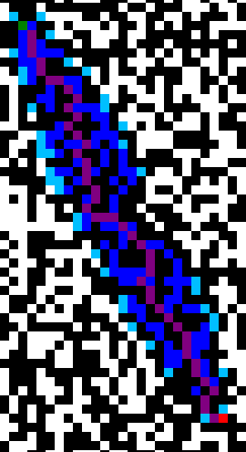
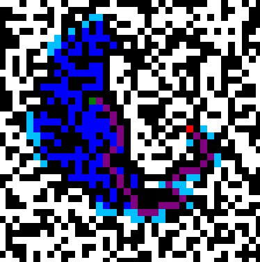

# A-Star Path Finding Algorithm

Implementation of A-Star Path Finding Algorithm

## setup
1. Run the code
2. Left click = start square
3. right click = finishing square

## result
  

Green - Start point  
Red - End point  
Dark-Blue - options that have been evaluation  
Light-Blue - options that are next to be evaluated  
Purple - The shortest path to the end